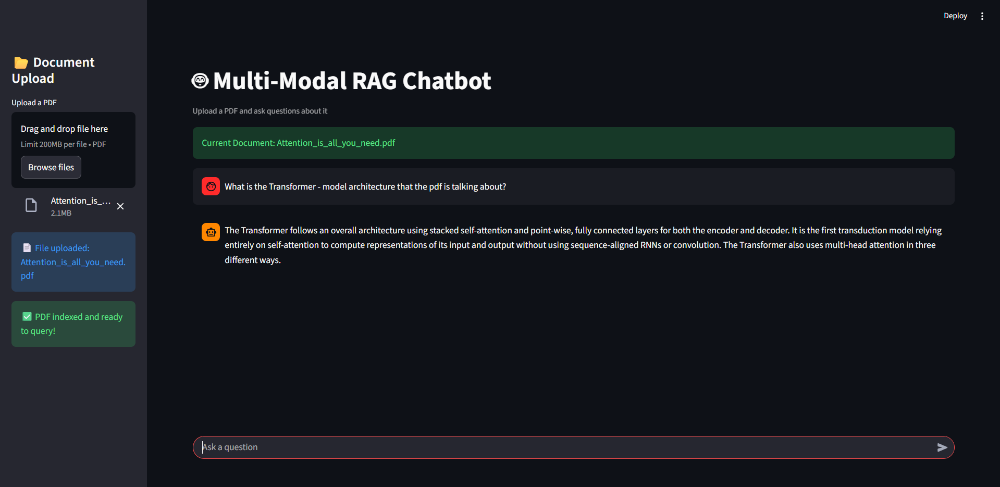

# 🧠 VectorMind — Multi-Modal RAG Chatbot

This is a **Multi-Modal Retrieval-Augmented Generation (RAG)** system that allows users to upload PDF documents and ask questions grounded strictly in document content.

The system supports structured text extraction, table parsing, OCR fallback for scanned PDFs, semantic retrieval using FAISS, and citation-aware answer generation using Gemini 2.5 Flash.

---

## 🖼️ Sample Application Interface



---

## 📊 System Overview

- **Architecture**: Retrieval-Augmented Generation (RAG)  
- **Embedding Model**: Sentence Transformers  
- **Vector Store**: FAISS (local similarity search)  
- **LLM**: Gemini 2.5 Flash  
- **Target**: Generate grounded answers strictly from document context  

---

## 🔍 Core Capabilities

### 📄 Document Ingestion
- Layout-aware parsing using Unstructured  
- Title, paragraph, list, and table extraction  
- Metadata preservation (page numbers)  
- OCR fallback for scanned/image-based PDFs  

### 🧠 Semantic Retrieval
- Dense vector embeddings  
- Cosine similarity search  
- Contextually ranked document chunks  
- Local FAISS index for high-speed retrieval  

### 🤖 Grounded Answer Generation
- Context-injected prompting  
- Hallucination reduction via strict document bounding  
- Page-level citation tagging  
- Deterministic response formatting  

---

## ⚙️ Enhancements

- Multi-modal ingestion pipeline  
- OCR-aware fallback logic  
- Normalized chunk processing  
- Modular retrieval and QA engine separation  
- Local vector database (no external dependency)  
- Citation transparency to improve answer reliability  

---

## 🛠 Tech Stack

| Layer | Tools Used |
|--------|------------|
| LLM | Gemini 2.5 Flash |
| Embeddings | Sentence Transformers |
| Vector Store | FAISS |
| Parsing | Unstructured |
| OCR | Tesseract |
| Orchestration | LangChain |
| UI | Streamlit |
| Core ML | PyTorch, Transformers |

---

## 🚀 How to Run Locally

### 1️⃣ Clone the repository

```bash
git clone https://github.com/Its-Itachi/VectorMind.git
cd VectorMind
````

### 2️⃣ Create a virtual environment

```bash
python -m venv venv
```

### 3️⃣ Activate the virtual environment

**Windows (PowerShell):**

```bash
venv\Scripts\activate
```

**macOS / Linux:**

```bash
source venv/bin/activate
```

### 4️⃣ Install dependencies

```bash
pip install -r requirements.txt
```

### 5️⃣ Set Environment Variable

Create a `.env` file:

```
GOOGLE_API_KEY=your_gemini_api_key
```

### ▶ Build Vector Index

```bash
python build_index.py
```

### ▶ Run Application

```bash
python -m streamlit run app.py
```

---

## 👤 Author

**Jayesh Dethe**

GitHub: [https://github.com/Its-Itachi](https://github.com/Its-Itachi)

---

## 📝 Notes

* The system enforces **document-bounded responses** to reduce hallucinations
* OCR support ensures compatibility with scanned academic PDFs
* Modular architecture allows extension to multi-document or image-based RAG

---

Happy coding! 🚀
